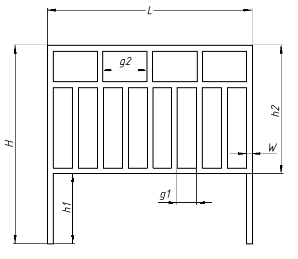

# InventorPlugin
[](https://github.com/Vanada1/InventorPlugin/actions/workflows/CI.yml)
## [Documents](https://github.com/Vanada1/InventorPlugin/tree/develop/Documents)
В данном каталоге находится вся документация к **InventorPlugin**:
- ClassDiagram.eapx — находится диаграмма классов приложения;
- Доп задания.docx — дополнительные задания, предложенные студентом;
- ПЗ.docx — пояснительная записка к приложению;
- Проект системы.docx — проект системы приложения;
- ТЗ.docx — техническое задание.

## [src](https://github.com/Vanada1/InventorPlugin/tree/develop/src)
В данном каталоге находится вся кодовая база приложения **InventorPlugin**:
- [Builder](https://github.com/Vanada1/InventorPlugin/tree/develop/src/Builder) — проект, в котором находится вся логика построения забора;
- [Common](https://github.com/Vanada1/InventorPlugin/tree/develop/src/Common) — все используемые библиотеке САПР (для Kompas 3D и Inventor);
- [CommonTestClass](https://github.com/Vanada1/InventorPlugin/tree/develop/src/CommonTestClass) — проект, в котором хранятся вспомогательные классы для модульного тестирования;
- [Core](https://github.com/Vanada1/InventorPlugin/tree/develop/src/Core) — проект бизнес логики приложения;
- [FenceBuildingVm](https://github.com/Vanada1/InventorPlugin/tree/develop/src/FenceBuildingVm) — проект модели представления (ViewModel) для главного окна приложения;
- [FenceBuldingUI](https://github.com/Vanada1/InventorPlugin/tree/develop/src/FenceBuldingUI) — проект пользовательского интерфейса приложения;
- [InventorApi](https://github.com/Vanada1/InventorPlugin/tree/develop/src/InventorApi) — проект работы с Inventor API;
- [KompasApi](https://github.com/Vanada1/InventorPlugin/tree/develop/src/KompasApi) — проект работы с Kompas 3D API;
- [Services](https://github.com/Vanada1/InventorPlugin/tree/develop/src/Services) — проект, в котором хранятся все сервисы;
- [StressTesting](https://github.com/Vanada1/InventorPlugin/tree/develop/src/StressTesting) — проект для нагрузочного тестирования;
- [TestBuilder](https://github.com/Vanada1/InventorPlugin/tree/develop/src/TestBuilder) — проект модульного тестирования проекта **Builder**;
- [TestCore](https://github.com/Vanada1/InventorPlugin/tree/develop/src/TestCore) — проект модульного тестирования проекта **Core**;
- [TestFenceBuildingVm](https://github.com/Vanada1/InventorPlugin/tree/develop/src/TestFenceBuildingVm) — проект модульного тестирования проекта **FenceBuildingVm**.

## Как проводить нагрузочное тестирование
1. Откройте Solution (**[InventorPlugin.sln](https://github.com/Vanada1/InventorPlugin/blob/develop/src/InventorPlugin.sln)**);
2. В проекте [StressTesting](https://github.com/Vanada1/InventorPlugin/tree/develop/src/StressTesting), в классе Program выберете нужный тест САПР (закомментируйте тот метод, который не нужно тестировать, и раскомментировать тот метод, который хотите протестировать)
3. Выберете Solution Configuration Release
4. Нажмите ПКМ по проекту StressTesting и выберете Rebuild
5. Откройте StressTesting.exe по пути `{место_репозитория}/InventorPlugin/src/StressTesting/bin/Release/StressTesting.exe`
6. Дождитесь пока САПР не упадет.
7. Результаты тестирования будут находиться в `logKompas 3D.txt` или `logInventor.txt` (зависит от выбранного САПР).

### Пример лога
```
1	00:00:16	8.92043264
2	00:00:23	9.005047808
3	00:00:29	9.080287232
4	00:00:35	9.204350976
5	00:00:42	9.264467968
6	00:00:49	9.34017024
7	00:00:57	9.434898432
8	00:01:02	9.483739136
9	00:01:09	9.663721472
10	00:01:15	9.559220224
11	00:01:23	9.840037888
12	00:01:30	9.916198912
13	00:01:37	9.919021056
14	00:01:43	9.899962368
15	00:01:50	9.937539072
16	00:01:55	9.930358784
```
Столбцы:
1. Номер созданной модели (забора);
2. Время, задраченное на создание, с момента начала прохождения нагрузочного тестирования;
3. Количество занимаемой оперативной памяти от всех процессов в ГБ.

## Чертеж забора


## Пример интерфейса


